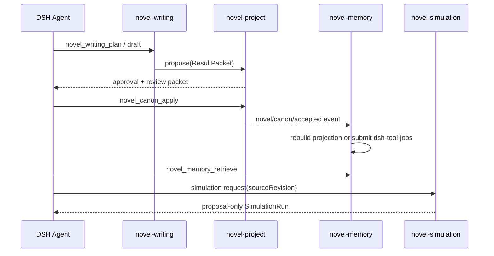

# novel-agent 插件具体设计 v2

本设计把 [tasks/plan-v2.md](../tasks/plan-v2.md) 落到包、Service、事件、Tool、Remote、Skill 和 UI Slot 级别。它描述目标边界，不代表这些包已经实现。

## 包与依赖

| 包 | 必需依赖 | 可选依赖 | 运行结果 |
| --- | --- | --- | --- |
| `@novel-agent/novel-project` | DSH storage/session/tools/typert/workspace | 无 | 只有 Canon 仍可创建项目、读取 Revision、审阅和回滚 |
| `@novel-agent/novel-writing` | `novel-project`、DSH skill/subagent | File Upload、Workspace | 没有 Memory/Simulation 仍能完成写作闭环 |
| `@novel-agent/novel-memory` | `novel-project`、Writing projection contract | 官方 `dsh-tool-jobs` | 没有 Jobs 时可同步读取，不能启动索引重建 |
| `@novel-agent/novel-simulation` | `novel-project` | Writing/Memory read-only Service | 缺少上层投影时只允许显式输入的单次实验 |

不建立 `novel-shared`、`novel-runtime` 或 `novel-bus` 包。跨包的类型契约由 Canon 导出最小公共类型；领域类型留在拥有它的插件中，依赖方只做 type-only import。

推荐安装组合：

```text
canon                         # 项目和 Revision 基础
canon + writing               # 默认可用写作产品
canon + writing + memory     # 连续性和写作记忆
canon + writing + simulation # 反事实实验
canon + writing + memory + simulation
```

每个包都有自己的 `cordis.patch.yml`，只插入自己；不包含社区插件、Profile、Bundle 聚合器或安装器。

## Canon 核心设计

### Host Service

`NovelProjectService` 继续作为现有包的安装入口，但收缩为以下公开能力：

```ts
interface NovelCanon {
  open(workspaceId: WorkspaceId): Promise<NovelProject>
  read(workspaceId: WorkspaceId, revision?: number): Promise<AcceptedRevision>
  propose(input: ResultPacketDraft): Promise<ResultPacketRef>
  preview(input: ResultPacketReview): Promise<ResultPacketImpact>
  apply(input: ResultPacketReview): Promise<AcceptedRevision>
  rollback(input: RollbackCommand): Promise<AcceptedRevision>
  registerExtension(extension: NovelCanonExtension): () => void
}
```

`registerExtension` 的运行时可用性必须在 Slice 1 先用 rc.2 focused RED 证实。若 DSH 的 Service 生命周期不允许此注册方式，改用核心已有 domain table 中的 namespace-keyed Delta；扩展插件自己投影，不增加第二个事件系统。

### 核心数据

- `ProjectRecord`：Workspace 绑定、当前 accepted revision、锁引用；
- `ResultPacket`：来源锚点、Manuscript、Delta、Issue、作者决策；
- `AcceptedRevision`：父 revision、接受决策、扩展 Delta 引用、回滚来源；
- `CanonExtension`：namespace、schema、projector、摘要函数；
- `CanonLock`：kind/target/field/value/sourceRevision。

核心不定义人物、关系、时钟、记忆、模拟等字段。它只校验扩展注册的 Delta，并确保一次 Apply 原子推进 Revision。

### 核心 Tool / Remote / UI

| 类型 | 名称 | 作用 |
| --- | --- | --- |
| Tool | `novel_canon_propose` | 产生待审阅 Result Packet，不推进 Revision |
| Tool | `novel_canon_apply` | 复用 DSH approval 后接受选定条目 |
| Tool | `novel_canon_rollback` | 通过同一 authority 生成回滚 Revision |
| Tool | `novel_canon_read` | 读取指定 Revision 的通用投影 |
| Remote | `novelProject.open/read/review/preview/rollback` | 为 Client 提供完整来源数据 |
| Slot | `novel-canon-review` | Result Packet、影响预览、历史、锁和回滚 |

所有写操作仍走 DSH Tool/approval；Remote 和 Slot 不直接写表。

## Writing 插件设计

### 领域 Service

```ts
interface NovelWriting {
  registerProjection(): void
  plan(input: WritingPlanRequest): Promise<ResultPacketRef>
  draft(input: WritingDraftRequest): Promise<ResultPacketRef>
  review(input: WritingReviewRequest): Promise<ResultPacketRef>
  chapterControl(input: ChapterControlQuery): Promise<ChapterControlPack>
}
```

Writing 在 `init` 时注入 `novelProject`、`skills`、`subagents`，注册自己的 Delta schema 和 projector。它不调用 `NovelProjectService` 的具体类，只调用 `NovelCanon` Service。

### Skills 分配

- `novel-architect`：根据 accepted Revision 生成 Project/Chapter plan；
- `novel-hook-payoff-planner`：提出局部张力与兑现提案；
- `novel-world-character-setting`：产生人物/世界设定 Delta；
- `novel-prose-writer`：生成带 unified diff 的 Manuscript 提案；
- `novel-reviewer`：对 Manuscript 和 Chapter contract 产生 Issue/修订提案。

`novel-continuity-checker` 与 `novel-writing-memory-organizer` 属于 Memory，因为它们的主要输入是历史 Revision 和跨章召回；Writing 只消费它们返回的只读 brief。

### Writing Delta namespace

初版只注册三组：

- `writing/narrative-unit`：Book/Volume/Arc/Chapter/Scene/Beat 顺序和父子关系；
- `writing/chapter-contract`：视角、场景功能、承诺、长度和验收门槛；
- `writing/manuscript`：正文版本、统一 diff、完整文本 hash 和来源锚点。

十类叙事时钟不作为第一版核心接口；只有某个 Writing 功能确实消费某个时钟时，才在 Writing namespace 增加对应 Delta。

### Tool / Remote / UI

| 类型 | 名称 | 作用 |
| --- | --- | --- |
| Tool | `novel_writing_plan` | 产生章节计划/合同 Result Packet |
| Tool | `novel_writing_draft` | 产生正文草稿 Result Packet |
| Tool | `novel_writing_review` | 产生 Issue 或修订正文提案 |
| Remote | `novelWriting.chapterControl` | 读取指定 accepted Revision 的章节上下文 |
| Slot | `novel-writing-stage` | 写作阶段、章节合同、草稿和审稿卡片 |

导入/导出先由 Writing 注册两个可选 Tool，直接调用 DSH File/Workspace；不为 IO 建立自己的 Store。

## Memory 插件设计

### 领域 Service

```ts
interface NovelMemory {
  retrieve(query: MemoryQuery): Promise<WritingMemoryRecall>
  chapterControl(query: ChapterControlQuery): Promise<ChapterControlPack>
  requestRebuild(input: RebuildIndexRequest): Promise<JobRef | SyncResult>
}
```

Memory 只读取 Canon accepted Revision 和 Writing 的 projection。它可以把索引作为可重建派生物保存在本地运行时，但不可把索引结果当作事实源。

### Memory Delta / 事件

Memory 默认不写 Canon。需要跨重启恢复的索引请求和连续性结果才记录 DSH 事件：

- `novel/memory/index-requested`：project、sourceRevision、job 参数；
- `novel/memory/continuity-found`：证据锚点、sourceRevision、issue 引用。

正文、人物状态、关系线等事实仍由 Writing 的 Result Packet 经 Canon Apply 写入。

### Tool / Remote / UI

| 类型 | 名称 | 作用 |
| --- | --- | --- |
| Tool | `novel_memory_retrieve` | revision-bound 召回和章节控制包 |
| Tool | `novel_memory_rebuild` | 同步重建或提交官方 Jobs |
| Remote | `novelMemory.retrieve/status` | 返回来源、范围、过期状态和 Job 状态 |
| Skill | `novel-continuity-checker`、`novel-writing-memory-organizer` | 只读检查与召回整理 |
| Slot | `novel-memory-recall` | 召回来源、连续性 Issue、索引状态 |

没有 Memory 插件时，Writing 的 chapterControl 使用最小 accepted manuscript 读取，不显示“记忆不可用”假面错误。

## Simulation 插件设计

### 领域 Service

```ts
interface NovelSimulation {
  runWorld(input: WorldSimulationRequest): Promise<SimulationRunRef>
  runReader(input: ReaderSimulationRequest): Promise<SimulationRunRef>
  read(runId: string): Promise<SimulationRun>
}
```

每个 run 固定 `sourceRevision`、输入 hash、replay key 和限制说明。Simulation 子流程只能读取 frozen projection，结果通过 DSH Session 事件保存，不能直接调用 Canon Apply。

### 分阶段能力

1. 单次故事世界 run：显式角色输入、有限动作、before/after/final state；
2. 单次读者反应 run：一个 accepted manuscript、显式 Persona 和 reading history；
3. 通过隔离 Profile 验证后，再考虑多 seed/分支矩阵；
4. 校准、真实反馈映射和长时间自动化最后评估。

### Tool / Remote / UI

| 类型 | 名称 | 作用 |
| --- | --- | --- |
| Tool | `novel_simulation_world` | 运行 proposal-only 世界实验 |
| Tool | `novel_simulation_reader` | 运行 proposal-only 读者反应 |
| Remote | `novelSimulation.read` | 读取完整 run、来源和限制 |
| Slot | `novel-simulation-run` | 最近实验、对比和“不会写入 Canon”提示 |

## 插件联动时序



跨插件只传 `projectId`、`sourceRevision`、Result Packet 引用和来源锚点；不传实现对象、不共享可变 Store、不复制完整 Canon。

## Client 组合规则

每个插件的 `src/client/index.ts` 只做三件事：挂载自己的生成 Remote、等待 `slots`、注册一个唯一 id 的 `conversation.view` Slot。Slot 的数据请求绑定当前 `sessionId` 和 `workspaceId`，在 Session/Workspace 改变时取消本地请求。

推荐顺序：Canon `10`、Writing `20`、Memory `30`、Simulation `40`。Slot 之间不互相调用；需要联动时由 Host Service 根据同一 Revision 返回来源引用。

## 从当前单插件拆分的落点

| 当前代码族 | 新归属 |
| --- | --- |
| domain table、项目打开/当前、Result Packet schema、preview/apply/rollback、lock、通用 Remote | `novel-project` |
| narrative unit、chapter contract、manuscript、写作阶段 prompt、architect/hook/world/prose/reviewer Skills | `novel-writing` |
| retrieve、chapter control pack、连续性、writing-memory、中文索引和 `novel-index` Job | `novel-memory` |
| story-world / reader-response SimulationRun、replay key、实验 UI | `novel-simulation` |
| TXT/Markdown/EPUB/DOCX 读写 | 先留在 Writing 的薄 capability，Slice 4 再决定 |

迁移顺序按表中从左到右执行。每次只搬一个能力族和对应测试，确认新包通过后删除核心中的无消费者代码。

## 首批验收用例

### Canon + Writing

1. 安装 Canon + Writing，Agent 创建项目并提交一个 Chapter contract；
2. Writer 产生草稿和 Review Issue；
3. 作者在同一 `conversation.view` 预览并 Apply，Revision 从 R1 到 R2；
4. 回滚生成 R3，刷新后两个 Slot 仍显示一致历史；
5. 只安装 Canon 时，核心 UI 可用，Writing Slot 不出现；只安装 Writing 时由 DSH pending injection 正常阻止启动。

### Memory

1. 在 R2 上召回 Chapter control pack，结果包含来源 Revision 和 Anchor；
2. R3 新增正文后旧 R2 召回不泄漏 R3；
3. 触发官方 Job，停止/重启 Host 后 Job 状态可重建，Canon hash 不变。

### Simulation

1. 固定 R2 运行世界实验和读者实验；
2. 结果在 reload 后可读，Canon 仍为 R2；
3. 故意让一个输入失败，另一独立 run 仍可结算，不能产生 Canon Delta。

每个用例都先写 focused RED，再做 GREEN，最后跑真实隔离 rc.2 Profile。没有 fresh Profile 证据的插件只能标记 `implemented-unverified`。
