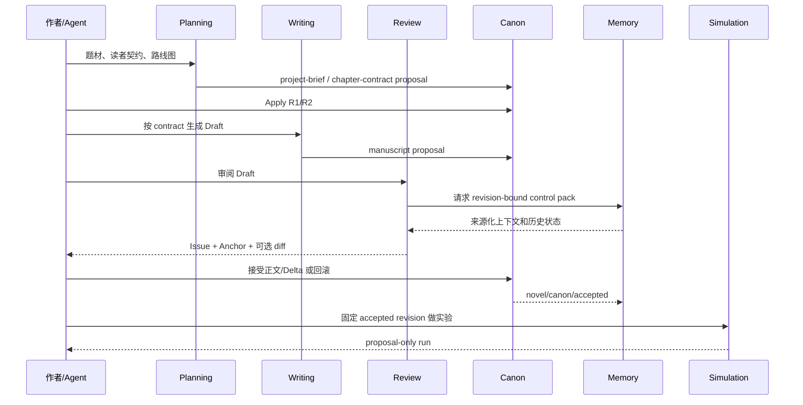

# 小说 Agent 插件设计 v3

本文件取代 `docs/plugin-design-v2.md` 中的四插件草案，依据 2026-09-05 的网文创作研究和 DSH 约束，把规划、写作、记忆、审阅、模拟分成独立但可组合的插件。

## 设计原则

插件按作者的工作阶段和失败边界拆分，而不是按每张数据表拆分：

- 规划失败不会污染正文；
- 写作失败不会污染 accepted Canon；
- 记忆/索引损坏可以重建，不成为事实源；
- 审阅只产生带证据的 Issue，不替作者 Apply；
- 模拟只读取 frozen Revision，不写 Canon；
- 所有插件都使用 DSH 原生 Agent、Session、Tool、Remote、Skill、Approval、Storage、Jobs 和 `conversation.view`。

## 插件清单

### `@novel-agent/novel-project`（逻辑角色：novel-canon）

**安装：必需。** 继续保留当前包名，职责收缩为唯一 Canon 核心。

**拥有：**

- Workspace 与 Novel Project 绑定；
- 通用 Result Packet（Manuscript、Delta、Issue、SourceAnchor、Provenance）；
- accepted Revision、父 revision、rollback、stale CAS、Canon lock；
- 事件回放和扩展 Delta 注册；
- 通用项目/Revision/Result Packet Remote 与审阅 Slot。

**不拥有：** 人物、关系、叙事时钟、记忆索引、模拟状态、角色提示和专用评分。

**公开 Service：** `open/read/propose/preview/apply/rollback/registerExtension`。

**Tools：** `novel_canon_propose`、`novel_canon_apply`、`novel_canon_rollback`、`novel_canon_read`。

### `@novel-agent/novel-planning`

**安装：默认。依赖 Canon。**

**解决痛点：** 选题漂移、开头不抓人、边写边想导致中段崩坏、伏笔没有回收窗口。

**拥有：**

- 题材、读者幻想、风格、禁区和更新目标；
- 一句话 premise、简介、主角处境和核心冲突；
- 世界底盘、势力、人物目标/资源/缺陷；
- Book/Volume/Arc 路线图、阶段目标、承诺和伏笔；
- Chapter/Scene/Beat contract，包含动作—反应、信息揭示、章末拉力和验收门槛。

**Skills：** `novel-idea-editor`、`novel-premise-planner`、`novel-outline-architect`、`novel-chapter-planner`。

**Delta namespace：** `planning/project-brief`、`planning/roadmap`、`planning/chapter-contract`、`planning/promise`、`planning/foreshadow`。

**Tools：** `novel_plan_project`、`novel_plan_chapter`。

**Remote/Slot：** `novelPlanning.readPlan`；`novel-planning-board`。

**明确不做：** 直接生成最终正文、读取未接受未来 revision、根据追读数字自动改主线。

### `@novel-agent/novel-writing`

**安装：默认。依赖 Canon + Planning。**

**解决痛点：** 草稿产出慢、风格漂移、模型一次写长文失控、修改无法回到稳定版本。

**拥有：**

- 按 Chapter contract 生成场景和正文；
- unified diff、正文 hash、段落来源 Anchor；
- style profile、叙述视角、句式/对白/感官约束；
- Plan → Draft → Rewrite 的可重试流程；
- 章节完成后的 post-check 提案。

**Skills：** `novel-prose-writer`、`novel-rewriter`、`novel-style-keeper`。

**Delta namespace：** `writing/narrative-unit`、`writing/manuscript`、`writing/style-profile`、`writing/chapter-state`。

**Tools：** `novel_write_draft`、`novel_write_rewrite`。

**Remote/Slot：** `novelWriting.chapterDraft`；`novel-writing-stage`。

导入/导出先作为 Writing 的薄 capability，直接消费 DSH File/Workspace；只有独立生命周期被证明后才拆 `novel-io`。

### `@novel-agent/novel-memory`

**安装：默认。依赖 Canon + Planning + Writing 的只读 projection。**

**解决痛点：** 忘记前文、人物状态冲突、读者知识越界、伏笔/债务无法追踪、索引重建成本高。

**拥有：**

- revision-bound retrieval；
- Chapter control pack；
- 人物、关系、世界规则、读者知识和债务的来源化投影；
- 连续性 Issue；
- 可重建索引和官方 Jobs 接入。

**Skills：** `novel-continuity-checker`、`novel-writing-memory-organizer`。

**Tools：** `novel_memory_retrieve`、`novel_memory_rebuild`。

**Remote/Slot：** `novelMemory.retrieve/status`；`novel-memory-recall`。

索引、摘要和召回排名都是派生物；任何人物事实、关系变化和正文仍必须回到 Writing Result Packet，经 Canon Apply 才成为事实。

### `@novel-agent/novel-review`

**安装：默认。依赖 Canon + Planning + Writing，读取 Memory control pack。**

**解决痛点：** 作者不知道哪里水、冲突没有反馈、开头没有期待、人物降智、伏笔只标记不兑现、风格与读者契约脱节。

**拥有：**

- 结构审阅：目标、障碍、结果、场景功能；
- 节奏审阅：动作—反应、压制/释放、章末拉力；
- 连续性审阅：人物/世界/时间/物件/知识边界；
- 伏笔与承诺审阅：首次证据、当前状态、回收窗口；
- 风格和读者契约审阅；
- 带 Anchor 的 Issue、严重度、影响范围和可选 unified diff。

**Skills：** `novel-structure-reviewer`、`novel-pacing-reviewer`、`novel-continuity-reviewer`、`novel-reader-contract-reviewer`。

**Tool：** `novel_review_manuscript`。

**Remote/Slot：** `novelReview.findings`；`novel-review-findings`。

Review 永远只提案，不自动拒绝章节或写入 Canon。作者可只接受 Issue/设定 Delta 而拒绝整段重写。

### `@novel-agent/novel-mirofish`

**安装：可选。依赖 Canon，可选读取 Planning/Memory；MiroFish 本身作为独立 AGPL-3.0 sidecar。**

**解决痛点：** 重大转折缺少预演、读者视角盲区、人物群体反应和多个走向难以比较。

**拥有：**

- 将 accepted Revision 编译为 MiroFish 图谱、Agent profile 和初始事件；
- 一个 accepted manuscript + Persona + reading history 的读者反应实验；
- 角色/势力在明确干预下的群体互动压力实验；
- replay key、输入 hash、限制和非市场代表标签。

**Skills：** `novel-mirofish-reader`、`novel-mirofish-character-pressure`。

**Tools：** `novel_mirofish_reader_reaction`、`novel_mirofish_character_pressure`、`novel_mirofish_status`、`novel_mirofish_interview`。

**Remote/Slot：** `novelMirofish.read`；`novel-mirofish-sandbox`。

第一版只支持 Reader Reaction 和 Character Pressure；完整 Plot Counterfactual 暂列 `blocked`，因为上游 OASIS 当前动作模型主要是 Twitter/Reddit 社交动作，不具备地点移动、资源、战斗和叙事因果状态机。

## 依赖与安装矩阵

| 组合 | 可用体验 |
| --- | --- |
| Canon | 项目、Revision、Result Packet 审阅和回滚 |
| Canon + Planning | 立项、路线图、章纲和承诺/伏笔登记 |
| Canon + Planning + Writing | 默认写作闭环 |
| 加 Memory | 跨章召回、连续性和写作记忆 |
| 加 Review | 结构/节奏/风格/契约审阅 |
| 加 MiroFish | 人物/读者群体反应沙盘与有限情景演绎 |

插件缺失时遵循 DSH 原生 pending injection；不写 fallback wrapper。Writing、Memory、Review 的默认组合在 README 里给出精确安装命令。

## 联动协议

### Canon accepted 事件

唯一跨插件事实事件为：`novel/canon/accepted` 和 `novel/canon/rolled-back`，载荷只含 `projectId`、`revision`、`deltaRefs`、`sourceSessionId`。Planning/Writing/Memory/Review 监听后刷新自己的只读 projection。

### 插件本地事件

- Memory：`novel/memory/index-requested`，交给官方 Jobs；
- Review：`novel/review/issue-proposed`，保留 Anchor 和 sourceRevision；
- MiroFish：`novel/mirofish/run-requested`、`novel/mirofish/run-completed`，只保存输入/结果引用。

本地事件不能绕过 Canon 直接提升事实等级。

### UI Slot

所有插件在 `conversation.view` 注册唯一 Slot id：

```text
novel-canon-review
novel-planning-board
novel-writing-stage
novel-memory-recall
novel-review-findings
novel-mirofish-sandbox
```

Slot 通过生成 Remote 读取完整结构化 payload；不解析 DSH 截断的模型预览，不创建新页面、Sidebar、TUI 或 Store。

## 典型联动



## 当前单插件迁移映射

| 当前 `novel-project` 代码族 | 目标插件 |
| --- | --- |
| domain table、项目打开/当前、Result Packet、preview/apply/rollback/lock、通用 Remote | Canon |
| narrative unit、chapter contract、project brief、roadmap、承诺/伏笔、architect/hook/world Skills | Planning |
| manuscript、style profile、prose writer、rewrite、写作阶段 | Writing |
| retrieve、chapter control pack、索引、中文检索、memory Skills | Memory |
| continuity/review findings、节奏/结构/契约检查 | Review |
| story-world/reader-response SimulationRun、replay key | `novel-mirofish` 适配层；MiroFish sidecar 保持上游独立 |
| TXT/Markdown/EPUB/DOCX | Writing 薄 capability，Slice 4 再决定 IO 包 |

迁移一次只搬一个能力族和对应测试；新包通过 focused gate 后删除核心中无消费者的类型、Tool、Remote 和 UI 分支。

## 首个验收小说与插件验收

验收样本为《雾港夜航：第七码头》前 12 章：四卷路线、六名关键角色、三条世界规则、三类关系/知识冲突、短中长伏笔和明确章末钩子。验收必须覆盖：

1. Planning 生成 R1 brief、R2 roadmap、章节 contracts；
2. Writing 逐章生成和重写，失败可重试且不污染 Canon；
3. Review 定位动作—反应、连续性、伏笔和读者契约问题；
4. Memory 在 R2 查询时不泄漏 R3，所有召回带 Anchor；
5. Canon 可接受“设定但拒绝正文”，并能回滚；
6. Simulation 固定 R2 运行后 Canon hash 不变；
7. 六个 Slot 在 reload 后与 Remote/Storage 一致。

## 实现前技术闸门

先用 DSH rc.2 源码和 focused RED 证实三件事：

1. Cordis Service 是否支持扩展插件在 init 时注册 Canon extension；
2. `SessionEventMap` 是否能承载跨插件 accepted/reverted 事件而不改变 DSH 核心；
3. 多个插件是否能各自挂载生成 Remote 并注册 `conversation.view` Slot。

若第 1 项不成立，立即采用 Canon 的 namespace-keyed generic Delta；不增加共享总线或第二个事件系统。闸门通过前不迁移完整十类时钟、复杂模拟或 IO。
